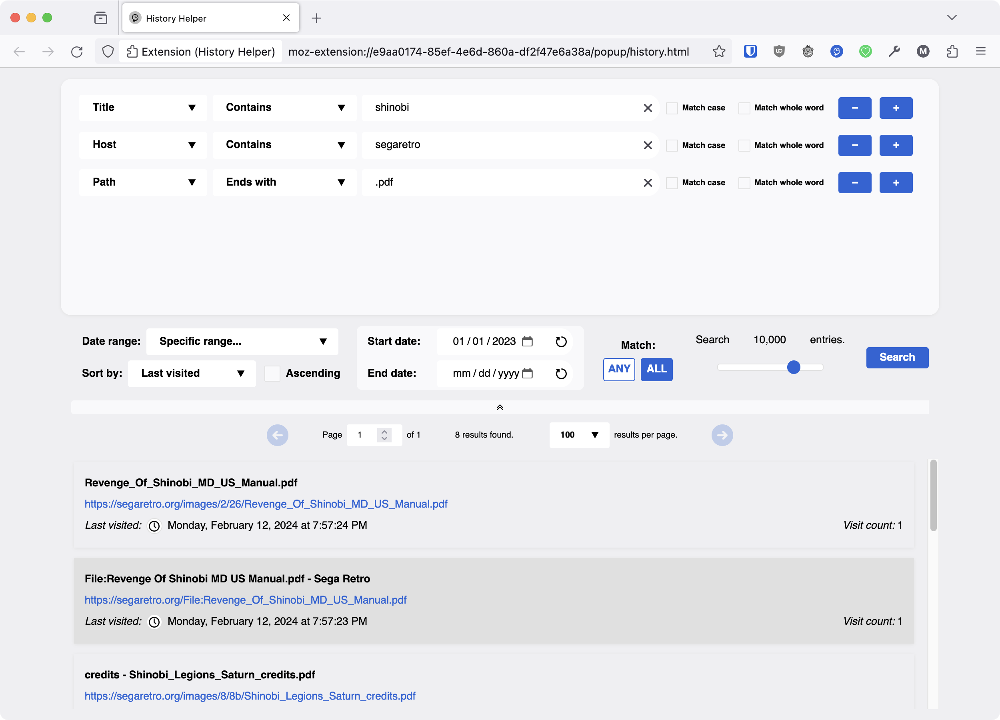

# history-helper

A Firefox extension for searching the browser history with a bit better filtering options than the default interface. Written in JavaScript.

## Installation

This extension can be installed through its [Firefox add-on page](https://addons.mozilla.org/en-US/firefox/addon/history-helper/) or from the [Chrome Web Store](https://chrome.google.com/webstore/detail/history-helper/lihpihkglefnedpciekffakoooffgdoa).

## Guide

After the extension is installed, a History Helper icon is added to your toolbar. Click this icon to open History Helper.

### Search fields

The top part of the interface shows the search fields. You can add new rows by clicking the ` + ` button. If there is more than one row, you can remove one by clicking its ` − ` button. You can change the search criteria of the row between *Title or URL*, *Title*, *URL*, *Host*, *Path*, or *Visit count*.

*Title or URL*, *Title*, *URL*, *Host*, and *Path* search the history for text using the following comparison operations:

- Is
- Is not
- Contains
- Does not contain
- Starts with
- Does not start with
- Ends with
- Does not end with
- Match
- Does not match

*Match* and *Does not match* are used for regular expressions. If there is a syntax error in the regular expression, an error icon appears at the end of the text field. Hovering the mouse cursor over this icon shows the error message. Rows containing errors are skipped when searching.

The *Match case* option does case-sensitive string comparisons. The *Match whole word* option only finds results where the search string is bordered by word boundary characters (such as spaces or hyphens) and not all substring matches. This option does not apply to the *Is*, *Is not*, *Match*, or *Does not match* operations. Each text field has a button to clear it.

*Visit count* filters the history by a numeric value using the following comparison operations:

- Equal to
- Not equal to
- Less than or equal to
- Less than
- Greater than or equal to
- Greater than

### Options

Below the search fields are some options.

**Date range** restricts the search to certain spans of time:

- Last hour
- Last day
- Last week
- Last month
- Last year
- All time

Or you can select *Specific range...*, which enables the **Start date** and **End date** fields for inputting a specific date range. Each date field has a button to reset it.

**Sort by** changes the order for displaying search results:

- Title
- URL
- Last visited
- Visit count

By default, *Title* and *URL* sorted in ascending order and *Last visited* and *Visit count* are sorted in descending order, but the order can be reversed by clicking on one of the sort icons below the options.

**Match** chooses whether *Any* or *All* search fields must be true for a history entry to match.

**Search entries** decides how many history entries to search. Smaller values result in less comprehensive search sets, but larger values take longer to complete. This value may be limited by the date range specified; for example, even if 100,000 entries is selected, it may end up searching far fewer than that if the specified date range does not contain that many history entries.

Finally, the **Search** button starts the search. For performance reasons, the extension does not automatically search the history as you type. It is also necessary to search again to change the sort order of results.

A split bar appears in between the options and the results. It can be used to shrink or expand the amount of space taken up by the search fields and the options.

### Results

The results are displayed after searching if any have been found. Results are split into multiple pages if there are too many to show on a single page. The sort order (ascending or descending) and the number of results shown on each page can be adjusted.

The title and URL may be truncated if they are too long to fit in the width of the display. Hovering over the title or URL with the cursor shows a tooltip containing the entire title or URL. Clicking the arrow icon next to a URL adds a search row that restricts searches to that host.

Hovering over a search result shows an X that can be clicked to remove the item from the browser history. Hovering over the pagination bar shows an X that can be clicked to remove the entire page of results from the browser history.

The *Last visited* date may be outside of the selected search range if the page was visited within the search range and then visited again later. When a page has been visited more than once, a cross icon appears that shows all visits to the page when pressed. Clicking the clock icon next to a date sets the **Start date** and **End date** fields to that day.

## Acknowledgments

Uses [navigation history vector](https://www.svgrepo.com/svg/36467/navigation-history-interface-symbol-of-a-clock-with-an-arrow) from [SVG Repo](https://www.svgrepo.com/).

## Authors

- J.C. Fields <jcfields@jcfields.dev>

## License

- [ISC license](https://opensource.org/licenses/ISC)
